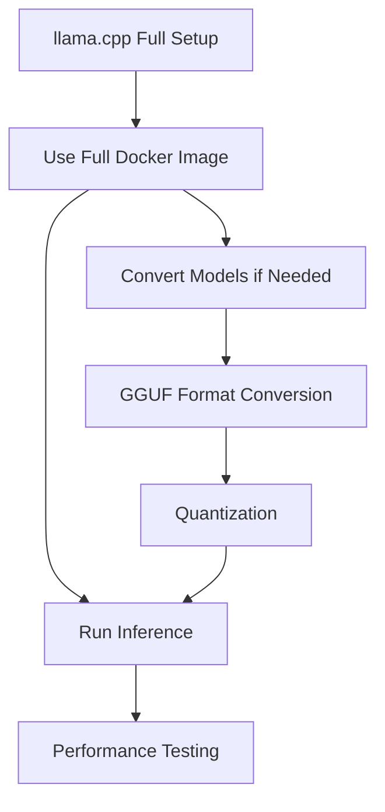

# Notes

## Comparing Blackbox and Amazon Q for multi file code generation
## Amazon Q

Question:

using Docker containers for each, i would like to implement aider chat using Llama.cpp, MLX, and Llamafile. I believe I need to set up a Docker container for Llama.cpp, Llamafile, and MLX. Then create a common API interface for all three. Next I would add a benchmarking script.

Response:

I suggest the following changes:

**docker-compose.yaml**
1. Add Docker services for Llama.cpp, MLX and Llamafile
   - Create a service for Llama.cpp
   - Create a service for MLX
   - Create a service for Llamafile

2. Configure each service with appropriate build, context, ports and volumes
3. Add a common network for all services

**packages/aider/aider/llm.py**
1. Create a new class called CommonLLMInterface
   - Add methods for initialization, query, and model information
2. Implement subclasses for Llama.cpp, MLX and Llamafile
   - Each subclass should inherit from CommonLLMInterface
   - Implement the interface methods for each specific implementation
3. Add a factory method to create instances of the appropriate LLM class

**packages/aider/aider/models.py**
1. Add new model configurations for Llama.cpp, MLX and Llamafile
   - Create ModelSettings for each new model
   - Configure appropriate parameters (e.g., edit_format, use_repo_map)
2. Update the MODEL_SETTINGS list to include the new models

**packages/aider/benchmark/benchmark.py:**
1. Create a new function called benchmark_llm_models
   - Input: list of model names to benchmark
   - Output: dictionary with benchmark results
2. Implement the benchmarking logic
   - Loop through each model
   - Run a set of predefined tasks
   - Measure performance metrics (e.g., response time, accuracy)

3. Add a command-line option to run the benchmark
   - Update the main function to include a new option for benchmarking

4. Implement result reporting
   - Create a function to generate a report from benchmark results
   - Output the report to a file or console

**packages/aider/aider/main.py:**
1. Update the main function to support the new LLM implementations
   - Add command-line options for selecting Llama.cpp, MLX, or Llamafile
   - Modify the model initialization logic to use the new CommonLLMInterface
2. Integrate the benchmarking functionality
   - Add a new command-line option to run benchmarks
   - Call the benchmark_llm_models function when the option is selected

**packages/aider/aider_config.yml:**
1. Add configuration options for Llama.cpp, MLX, and Llamafile
   - Include model paths, API endpoints, and other relevant settings
2. Update the weak_model setting to support the new models

**packages/aider/README.md:**
1. Update the README to include information about the new LLM implementations
   - Add a section describing the support for Llama.cpp, MLX, and Llamafile
   - Include instructions for using the new models and running benchmarks
2. Update the "Features" section to mention the new capabilities

## Blackbox

Implementing an Aider Chat Using Llama.cpp, MLX, and Llamafile with Docker Containers
You're on the right track with your plan. Here's a step-by-step guide to help you achieve your goal:

Step 1: Set up Docker Containers
Create separate Docker containers for Llama.cpp, Llamafile, and MLX. You'll need to create a Dockerfile for each, specifying the base image, dependencies, and build instructions.

Llama.cpp Dockerfile
```
FROM ubuntu:20.04

# Install dependencies
RUN apt-get update && apt-get install -y \
    build-essential \
    libboost-all-dev \
    libssl-dev \
    libgflags-dev \
    libgoogle-glog-dev

# Copy Llama.cpp code
COPY . /app

# Build Llama.cpp
WORKDIR /app
RUN mkdir build && cd build && cmake .. && make

# Expose port
EXPOSE 8080

# Run Llama.cpp
CMD ["./build/llama", "--port=8080"]
```

Llamafile Dockerfile
```
FROM python:3.9-slim

# Install dependencies
RUN pip install -r requirements.txt

# Copy Llamafile code
COPY . /app

# Expose port
EXPOSE 8081

# Run Llamafile
CMD ["python", "app.py"]
```

MLX Dockerfile

```
FROM node:14

# Install dependencies
RUN npm install

# Copy MLX code
COPY . /app

# Expose port
EXPOSE 8082

# Run MLX
CMD ["node", "app.js"]``

```
Step 2: Create a Common API Interface
Design a RESTful API that will serve as an interface for all three services. You can use a framework like Flask (Python) or Express.js (Node.js) to create the API.

For example, you can create an API with the following endpoints:

/llama: Calls the Llama.cpp service
/llamafile: Calls the Llamafile service
/mlx: Calls the MLX service
Step 3: Implement Benchmarking Script
Create a script that will benchmark the performance of each service. You can use tools like ab (Apache Bench) or locust to simulate traffic and measure response times.

For example, you can create a Python script using requests and time libraries to benchmark the API endpoints:

```
import requests
import time

def benchmark(endpoint):
    start_time = time.time()
    response = requests.get(endpoint)
    end_time = time.time()
    print(f"Endpoint: {endpoint}, Response Time: {end_time - start_time} seconds")

# Benchmark Llama.cpp
benchmark("http://localhost:8080/llama")

# Benchmark Llamafile
benchmark("http://localhost:8081/llamafile")

# Benchmark MLX
benchmark("http://localhost:8082/mlx")
```
Step 4: Run the Containers and Benchmark
Run the Docker containers using docker-compose or docker run commands. Then, run the benchmarking script to test the performance of each service.

That's a high-level overview of the steps you can follow to implement an Aider chat using Llama.cpp, MLX, and Llamafile with Docker containers. If you need more detailed instructions or have specific questions, feel free to ask!

Claude

You're absolutely right, and that's an excellent observation. If you're unsure about the format of your models or need to convert them, using the full version of the llama.cpp Docker image is indeed the best approach. Let's adjust our plan accordingly.



Updated Checklist Roadmap:
- [x] Choose full version of llama.cpp Docker image
- [ ] Set up Docker environment for model conversion
- [ ] Convert models to GGUF format if necessary
- [ ] Quantize models for optimal performance
- [ ] Set up inference environment
- [ ] Integrate with benchmarking setup

Let's update our approach to use the full version of llama.cpp:

1. Choose Docker Image:
   We'll use the full image: `ghcr.io/ggerganov/llama.cpp:full`

2. Set up Docker Run Command for Model Conversion:
   ```bash
   docker run -v /path/to/models:/models ghcr.io/ggerganov/llama.cpp:full --all-in-one "/models/" deepseek-coder-6.7b-instruct
   ```
   This command will convert the model to GGUF format and create quantized versions.

3. Update docker-compose.yaml:
   ```yaml
   version: '3'
   services:
     llama-cpp:
       image: ghcr.io/ggerganov/llama.cpp:full
       ports:
         - "8080:8080"
       volumes:
         - ./models:/models
       command: --run -m /models/deepseek-coder-6.7b-instruct/ggml-model-q4_0.gguf --port 8080 --host 0.0.0.0
   ```

4. Model Conversion and Quantization Process:
   Before running the inference, you'll need to convert and quantize your model. Here's a step-by-step process:

   a. Place your original model files in the `/path/to/models` directory.

   b. Run the conversion process:
      ```bash
      docker run -v /path/to/models:/models ghcr.io/ggerganov/llama.cpp:full --all-in-one "/models/" deepseek-coder-6.7b-instruct
      ```

   c. This will create a new directory with the converted and quantized model files.

5. Update benchmarking script:
   The benchmarking script remains similar to the previous version, but make sure it's using the correct endpoint:

   ```python
   import requests
   import time
   import statistics

   def benchmark_llama_cpp(prompt, num_runs=10):
       url = "http://localhost:8080/completion"
       data = {
           "prompt": prompt,
           "n_predict": 100
       }
       times = []
       for _ in range(num_runs):
           start_time = time.time()
           response = requests.post(url, json=data)
           end_time = time.time()
           times.append(end_time - start_time)

       avg_time = statistics.mean(times)
       std_dev = statistics.stdev(times)
       return avg_time, std_dev

   prompt = "def fibonacci(n):"
   avg_time, std_dev = benchmark_llama_cpp(prompt)
   print(f"llama.cpp: Avg time: {avg_time:.4f}s, Std Dev: {std_dev:.4f}s")
   ```

Next steps:
1. Ensure your models are in the designated directory (/path/to/models).
2. Run the model conversion and quantization process.
3. Update the docker-compose.yaml file with the llama.cpp service as shown above.
4. Run the containers:
   ```
   docker-compose up
   ```
5. Execute the benchmarking script to test llama.cpp performance.

Questions to consider:
1. What is the current format of your deepseek-coder model? (e.g., PyTorch, Hugging Face, etc.)
2. Do you have a preference for quantization level? (e.g., q4_0, q4_1, q5_0, etc.)
3. Are there any specific model parameters you want to maintain during the conversion process?

This setup gives you the flexibility to convert models as needed and run inference all within the same Docker environment. The full image ensures you have all the necessary tools for both conversion and inference.

If you encounter any issues during the conversion process or need help interpreting the results, please don't hesitate to ask. Also, remember that model conversion can be resource-intensive, so ensure your Mac M1 has sufficient memory and storage available.