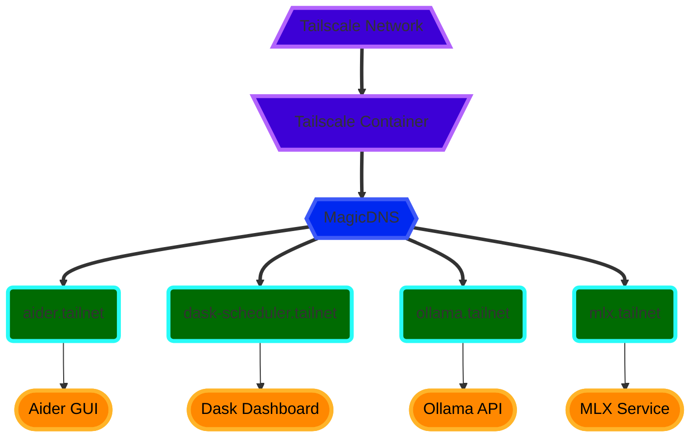

```mermaid
  graph TD
    Tailnet[/Tailscale Network\] ==> TailscaleContainer[\Tailscale Container/]
  TailscaleContainer ==> MagicDNS{{MagicDNS}}
  MagicDNS ==> Aider(aider.tailnet)
  MagicDNS ==> Dask(dask-scheduler.tailnet)
  MagicDNS ==> Ollama(ollama.tailnet)
  MagicDNS ==> MLX(mlx.tailnet)
  Aider --> AiderGUI([Aider GUI])
  Dask --> DaskDashboard([Dask Dashboard])
  Ollama --> OllamaAPI([Ollama API])
  MLX --> MLXService([MLX Service])

  style Tailnet stroke:#b263fc,fill:#3d00d6,stroke-width:4px
  style TailscaleContainer stroke:#b263fc,fill:#3d00d6,stroke-width:4px
  style MagicDNS stroke:#3d59f7,fill:#0028f0,stroke-width:4px
  style Aider stroke:#27fbf7,fill:#006b02,stroke-width:4px
  style AiderGUI stroke:#ffb429,fill:#ff8800,stroke-width:4px,color:#000000
  style Dask stroke:#27fbf7,fill:#006b02,stroke-width:4px
  style DaskDashboard stroke:#ffb429,fill:#ff8800,stroke-width:4px,color:#000000
  style Ollama stroke:#27fbf7,fill:#006b02,stroke-width:4px
  style OllamaAPI stroke:#ffb429,fill:#ff8800,stroke-width:4px,color:#000000
  style MLX stroke:#27fbf7,fill:#006b02,stroke-width:4px
  style MLXService stroke:#ffb429,fill:#ff8800,stroke-width:4px,color:#000000

```
