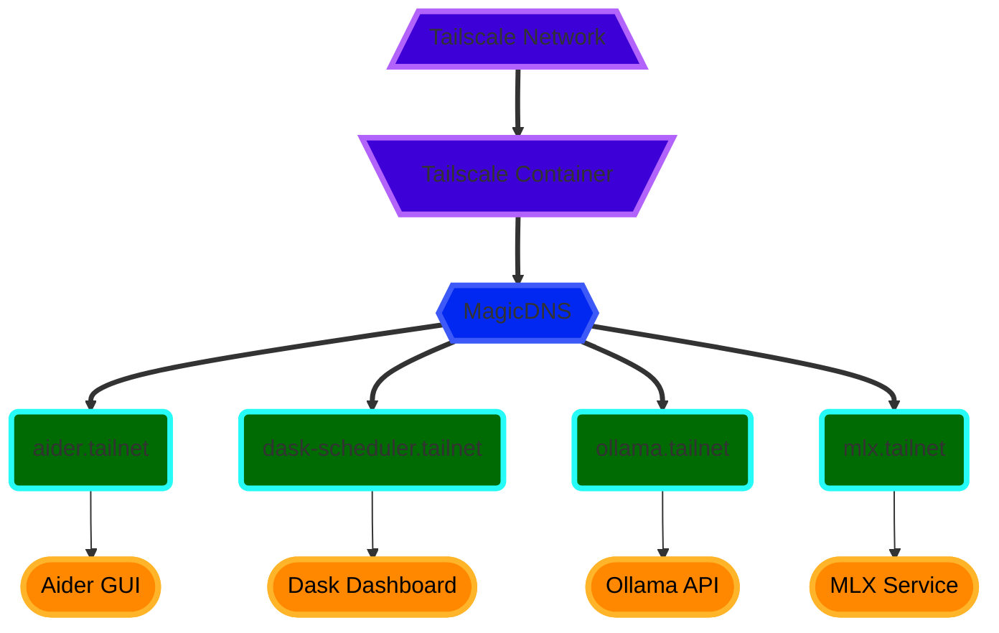

# Aigency

<link rel="stylesheet" href="https://cdnjs.cloudflare.com/ajax/libs/font-awesome/6.4.0/css/all.min.css">

## <i class="fas fa-bolt-lightning"></i> Quickstart

### <i class="fas fa-satellite-dish"></i> Join the Tailnet
---
#### Via the webserver
- [http://100.100.100.100](http://100.100.100.100) <i class="fas fa-long-arrow-right"></i> the web GUI for your device
- <i class="fas fa-terminal"></i> `tailscale web` also starts a web server at
  - [http://<device_ip>:5252](http://<device_ip>:5252)
  - [http://localhost:8080](http://localhost:8080)

#### Authenticate
- docker run --rm -v ./ollama-models:/root/.ollama ollama/ollama pull deepseek-coder-v2
- Web GUI opens in Read Only mode
- Click "Viewing" button to authenticate

### <i class="fas fa-wrench"></i> Build && Run The Docker Container
---
<!-- *TODO - explain environment variable details -->
- <i class="fas fa-copy"></i> Copy or rename ".example.env" to ".env"
- <i class="fas fa-terminal"></i> run `docker compose up --build`

- <i class="fas fa-server"></i> Services are available at
  - tailscale
    - <i class="fas fa-arrow-right"></i> http://aigency-tailnet
  - dask
    - Scheduler --> tcp://aigency-tailnet:8786
    - Dashboard --> http://aigency-tailnet:8787/status
  - dask-worker
  - mlx
    -
  - ollama
    - base --> http://aigency-tailnet:11434
    - models --> http://aigency-tailnet:11434/api/tags
    - --> http://aigency-tailnet:11434/api/generate
  - aider
    - GUI --> http://aigency-tailnet:8501

- For live reloading Docker Containers on code change
  - `docker compose up --watch`

## <i class="fas fa-microchip"></i> System Architecture (W.I.P.)

