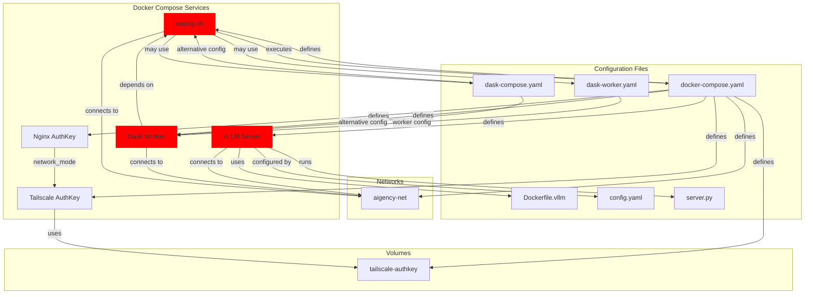

---
config:
  theme: neo-dark
---

```mermaid
graph TD
  subgraph "Docker Compose Services"
        TS[Tailscale AuthKey]
        NG[Nginx AuthKey]
        DS[Dask Scheduler]
        DW[Dask Worker]
        VL[vLLM Server]
    end
    subgraph "Networks"
        AN[aigency-net]
    end
    subgraph "Volumes"
        TV[tailscale-authkey]
    end
    subgraph "Configuration Files"
        DC[docker-compose.yaml]
        DCM[dask-compose.yaml]
        DWY[dask-worker.yaml]
        DS[deploy.sh]
        DV[Dockerfile.vllm]
        CY[config.yaml]
        SP[server.py]
    end
    TS -->|uses| TV
    NG -->|network_mode| TS
    DS -->|connects to| AN
    DW -->|connects to| AN
    DW -->|depends on| DS
    VL -->|connects to| AN
    DC -->|defines| TS
    DC -->|defines| NG
    DC -->|defines| DS
    DC -->|defines| DW
    DC -->|defines| VL
    DC -->|defines| AN
    DC -->|defines| TV
    DCM -->|alternative config| DS
    DCM -->|alternative config| DW
    DWY -->|worker config| DW
    DS -->|executes| DC
    DS -->|may use| DCM
    DS -->|may use| DWY
    VL -->|uses| DV
    VL -->|configured by| CY
    VL -->|runs| SP
    classDef error fill:#f00,stroke:#f00,text:#000;
    class VL,DW,DS error;
```